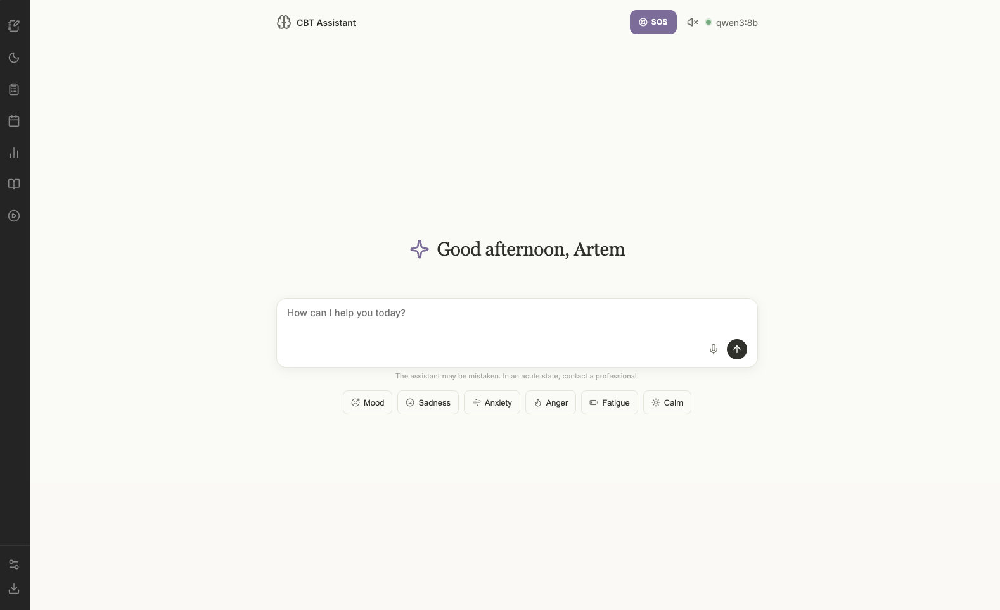

<p align="center">
  
</p>

# CBT Assistant

A local CBT-style AI assistant with a web UI, Ollama, RAG-based knowledge search, conversational memory, journals, assessments, and SOS practices.

Current release: `1.0.1`

The project is designed for local use: the backend runs on FastAPI, the frontend is served as a static web app, and both model responses and embeddings are handled through a local Ollama server.



## What This Is

CBT Assistant combines several workflows in one application:

- chat with a local LLM;
- semantic RAG search over CBT materials;
- message history and session summaries stored in SQLite;
- thought journaling and sleep journaling;
- self-assessment with PHQ-9, GAD-7, and Rosenberg Self-Esteem Scale;
- SOS tools for breathing, grounding, and short crisis-support practices;
- TTS playback and browser voice input.

This is not a medical device and not a replacement for a doctor or therapist. It is useful as a local self-help assistant, but not as a source of diagnosis or emergency support.

## Key Features

- `RU/EN` interface with assistant reply language switching.
- Standard and streaming chat via `/api/chat` and `/api/chat/stream`.
- Tool calling inside the conversation: knowledge search, sleep history, test history, activity history, activity creation, breathing practice trigger, and assessment recommendation.
- Local knowledge base in `knowledge_base/*.md` with embeddings powered by Ollama.
- Session memory with background conversation summarization.
- Data stored in SQLite and partly in browser `localStorage`.
- Report and history export flows.
- Web UI built with plain `HTML/CSS/JS`, no heavy frontend framework.

## How It Works

### Request Flow

```
Browser (frontend)
    │
    ▼
FastAPI backend (backend/server.py)
    ├── loads system prompt from config/prompts.yaml
    ├── fetches session history + summary from SQLite
    ├── runs tool calls (knowledge search, activity lookup, etc.)
    │       └── RAG: embeds query → searches knowledge_base/ via Ollama embeddings
    └── sends full context to Ollama LLM → streams reply back to browser
```

1. The user opens the frontend at `http://localhost:8000`.
2. The FastAPI backend serves the API, websocket chat, TTS, and static files.
3. Messages and user records are stored in SQLite.
4. When generating a reply, the assistant uses:
   - the system prompt from `config/prompts.yaml`,
   - session history and summary,
   - tool calling,
   - RAG search over the local knowledge base.
5. Ollama is used for:
   - the main LLM;
   - the embedding model for semantic search.

### Main Components

- [backend/server.py](backend/server.py) - FastAPI server and API logic.
- [src/llm/ollama_client.py](src/llm/ollama_client.py) - client for `Ollama /api/chat`.
- [src/rag/knowledge_base.py](src/rag/knowledge_base.py) - knowledge base loading and semantic search.
- [src/utils/db.py](src/utils/db.py) - SQLite storage for sessions, journals, and synced data.
- [src/memory/summarizer.py](src/memory/summarizer.py) - short-term memory / conversation summary logic.
- [frontend/index.html](frontend/index.html) - main UI.

## Technology Stack

- Backend: FastAPI
- Frontend: vanilla HTML/CSS/JS
- LLM: Ollama
- Default model: `qwen3:8b`
- Embeddings: `qwen3-embedding:4b`
- TTS: `edge-tts` / Microsoft Edge voices
- Storage: SQLite + browser `localStorage`
- Tests: `pytest`
- License: MIT

## Quick Start

### Requirements

- Python 3.10+
- [Ollama](https://ollama.com/) installed and running
- Ollama server available at `http://localhost:11434`

> **Windows / Linux:** the macOS `.command` launcher is not available, but the manual steps below work on all platforms.

### Installation

```bash
python -m venv .venv
source .venv/bin/activate        # Windows: .venv\Scripts\activate
pip install -r requirements.txt
```

### Prepare Models

```bash
ollama serve
ollama pull qwen3:8b
ollama pull qwen3-embedding:4b
```

### Run

In one terminal:

```bash
ollama serve
```

In another:

```bash
source .venv/bin/activate        # Windows: .venv\Scripts\activate
python backend/server.py
```

Then open:

```text
http://localhost:8000
```

### Quick Launch on macOS

The repo includes a helper script, [start_cbt_assistant.command](start_cbt_assistant.command), which:

- checks that `.venv/bin/python` exists;
- starts the backend in Terminal;
- waits for the healthcheck;
- opens the app in the browser.

## Configuration

Supported environment variables:

```bash
OLLAMA_BASE_URL=http://localhost:11434
OLLAMA_MODEL=qwen3:8b
```

Model parameters live in [config/model_config.yaml](config/model_config.yaml), and system prompts live in [config/prompts.yaml](config/prompts.yaml).

## Data Storage

### Backend

- SQLite database: `data/cbt_sessions.db`
- It stores:
  - sessions;
  - message history;
  - mood logs;
  - thought records;
  - sleep logs;
  - assessment results;
  - activities;
  - session summaries.

### Browser

Some settings and client-side data are stored in `localStorage`:

| Key | What it holds |
|-----|---------------|
| `sleepLog` | Sleep journal entries (bedtime, wake time, quality) |
| `activities` | User-defined behavioral activation activities |
| `phqHistory` | PHQ-9 depression assessment history |
| `gadHistory` | GAD-7 anxiety assessment history |
| `esteemHistory` | Rosenberg Self-Esteem Scale history |
| `notifSettings` | Notification preferences |
| `ttsSettings` | Text-to-speech voice and speed settings |
| `APP_LANG` | Selected interface language (`ru` or `en`) |

Local runtime data in `data/` is intentionally gitignored so personal session data does not get committed to the repository.

## API Overview

### Chat

- `POST /api/chat`
- `POST /api/chat/stream`
- `WS /ws/chat/{session_id}`

### User Data

- `POST /api/mood`
- `GET /api/mood/{session_id}`
- `POST /api/thoughts`
- `GET /api/thoughts/{session_id}`
- `GET /api/session/{session_id}`
- `POST /api/session/{session_id}/save`

### Sync

- `POST /api/sync/sleep`
- `POST /api/sync/tests`
- `POST /api/sync/activities`

### Knowledge and Insights

- `GET /api/knowledge/search`
- `POST /api/insights`
- `GET /api/health`
- `GET /api/report/{session_id}`
- `POST /api/tts`

## Project Structure

```text
backend/
  server.py                FastAPI backend
frontend/
  index.html               main interface
  css/
  js/
src/
  llm/                     Ollama client
  rag/                     semantic RAG
  memory/                  summary / memory logic
  prompts/                 prompt builder
  utils/                   SQLite and helpers
knowledge_base/            CBT materials for RAG
config/                    model and prompt config
data/                      SQLite database (gitignored)
docs/
  img/                     screenshots and assets
tests/                     pytest suite
```

## Tests

Run:

```bash
pytest
```

The project includes tests for:

- database logic;
- the RAG component;
- prompt logic;
- server endpoints;
- memory logic;
- parts of end-to-end user flows.

## Troubleshooting

**Startup is slow or hangs**
On first run, embeddings are generated for all files in `knowledge_base/`. This can take a minute or two depending on hardware. Subsequent starts are fast.

**`qwen3-embedding:4b` not found**
The backend will attempt to pull it automatically via Ollama, but it is better to pull it manually before starting:
```bash
ollama pull qwen3-embedding:4b
```

**Port 8000 already in use**
Another process is occupying the port. Either stop it or change the port in `backend/server.py`.

**Ollama connection refused**
Make sure `ollama serve` is running before starting the backend. Check that `OLLAMA_BASE_URL` points to the correct address.

**Voice input not working**
Voice input uses the browser's Web Speech API, which is only available in Chromium-based browsers (Chrome, Edge) and Safari. It does not work in Firefox.

**TTS not working**
Requires the `edge-tts` package (included in `requirements.txt`) and a working internet connection for the first request. Check that the backend is running and reachable.

## Practical Notes

- Some state lives in the browser and some in SQLite, so synchronization is not fully automatic in every scenario.
- A production deployment would require additional work around security, authentication, privacy controls, and deployment hardening.

## Limitations and Safety

- The application is not intended for emergency psychiatric support.
- The assistant can be wrong, hallucinate, or produce incomplete recommendations.
- Assessment results and assistant responses must not be treated as a medical diagnosis.

## License

This project is released under the MIT License. See [LICENSE](LICENSE).
