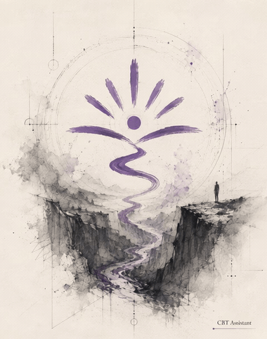

# CBT Assistant — Local AI Mental Health Chatbot & CBT Journal with Ollama

A local-first application featuring structured thought records, mood and sleep tracking, self-assessments, and SOS exercises. Includes a conversational AI grounded in a built-in CBT knowledge base via RAG, with persistent session memory.

<a id="installation"></a>

```bash
# macOS 14+
git clone https://github.com/KazKozDev/cbt-assistant.git && cd cbt-assistant && ./start_cbt_assistant.command
```
```bash
# Windows 10 22H2+ (PowerShell or cmd)
git clone https://github.com/KazKozDev/cbt-assistant.git
cd cbt-assistant
start_cbt_assistant.bat
```
```bash
# Linux
git clone https://github.com/KazKozDev/cbt-assistant.git && cd cbt-assistant
python3 -m venv .venv
source .venv/bin/activate
python -m pip install -r requirements.txt
ollama pull qwen3.5:9b
python backend/server.py
```

<p align="center">
  
</p>

## Quick start: run the local AI CBT chatbot

1. Use the platform-specific commands above. The macOS and Windows launchers automatically set up the Python environment, prepare Ollama, download `qwen3.5:9b`, start the server on port `8000`, and open your browser. Subsequent launches will reuse this setup. On Linux, ensure `ollama serve` is running, execute the commands, and open `http://localhost:8000`.
2. Begin by chatting or launching an **SOS** practice. During a conversation, the assistant can proactively suggest and configure a specific SOS practice, scene, or a 1–10 minute timer if you agree.
3. Switch between English and Russian in **Settings**.

> [!IMPORTANT]
> CBT Assistant is a self-help and journaling tool, not a therapist, medical device, crisis service, or substitute for professional care. The entire local knowledge base is built directly on clinical research and evidence-based CBT protocols for depression, depressive episodes, anxiety, and low-mood states, but AI-generated responses and self-assessments can still be imperfect. If you may be in immediate danger or at risk of harming yourself or someone else, contact local emergency services or a qualified crisis service now.

## CBT journal app, mood tracker, self-assessments, and SOS exercises

These records provide future conversation context instead of leaving each chat isolated. Messages and Thought Diary entries are stored in SQLite; interface logs and screening state also use browser `localStorage`.

- **Progress Dashboard:** Visual charts and analytics tracking your mood dynamics, sleep patterns, and emotional wellbeing trends over time.
- **Records Calendar:** An interactive month-view calendar unifying daily entries across thoughts, mood, sleep, planned activities, and test scores.
- **Clinical Self-Assessments:** Standardized psychometric screening tools (PHQ-9 for depression, GAD-7 for anxiety, Rosenberg Self-Esteem, and Burnout assessment) with score interpretations.
- **Thought Diary:** Log situations, automatic thoughts, emotions, intensities, cognitive distortions, and rational responses.
- **Mood & Sleep Logs:** Track daily scores, notes, sleep duration, interruptions, and sleep quality.
- **SOS Portals:** Fullscreen interactive guides for paced breathing, 5-4-3-2-1 grounding, progressive muscle relaxation, and STOP techniques, featuring visual scenes, sound, and countdowns.
- **Voice Mode & Speech Input:** Hands-free voice conversation with microphone speech recognition and realistic neural text-to-speech voice responses (English and Russian).
- **Reports:** Generate text summaries or printable PDF reports directly in the browser.

## Private AI mental health chatbot with local memory

The default chat model is [`qwen3.5:9b`](https://ollama.com/library/qwen3.5). The assistant maintains **durable long-term memory across sessions** by persisting a structured personal profile and rolling conversation summaries in SQLite.

- **Empathetic, Open Dialogue:** A completely private, safe space to speak your mind, vent about tough days, talk heart-to-heart, and receive warm, non-judgmental support.
- **Strict Clinical Grounding (No Hallucinations):** Prompt-engineered and gated by FastEmbed RAG to avoid inventing psychological concepts or hallucinating clinical protocols. It strictly bases therapeutic guidance on verified, evidence-based CBT knowledge (`[KB:chunk_id]`), abstaining from fabricated advice when context is absent.
- **AI Tools & Direct Journaling:** During chat, you can ask the assistant to directly record structured entries into your **Thought Diary** (analyzing automatic thoughts, cognitive distortions, and rational responses) or log your **Sleep Diary** (bedtime, wake time, duration, and sleep quality).
- **Proactive Interventions:** The AI can launch agreed fullscreen **SOS portals**, schedule planned activities, or pull recent sleep, mood, and screening assessments for contextual guidance.
- **Cross-Session Memory:** A persistent `SESSION_ID` ensures your conversation context, personal profile, and rolling summary survive browser reloads and app restarts.

Manage your derived profile and summary via:

```text
GET    /api/memory/{session_id}
DELETE /api/memory/{session_id}
```

## Local CBT knowledge base with RAG and FastEmbed

At startup, `src/rag/knowledge_base.py` splits the bundled Markdown CBT library by heading hierarchy and computes embeddings locally using FastEmbed (`paraphrase-multilingual-mpnet-base-v2`). The model cannot bypass this retrieval path.

```text
GET /api/knowledge/search?q=sleep&top_k=3
GET /api/knowledge/status
```

Search results include stable chunk and document IDs, source paths, section hierarchy, similarity scores, index version, and a local trace ID. The AI is instructed to cite clinical claims as `[KB:chunk_id]`. The default similarity threshold is `0.46`. When no passage clears it, the assistant provides general support but does not invent specific CBT protocols.

## How the local AI assistant works

```text
Browser UI
   ↓
FastAPI REST + WebSocket API
   ↓
Prompt assembly ← CBT knowledge search
   ↓                     ↓
Ollama chat          FastEmbed (CPU / ONNX)
   ↓                     ↓
Response             Markdown knowledge base
   └──────── SQLite + browser localStorage
```

The backend persists messages and structured records in SQLite. RAG restores a matching cached NumPy index or rebuilds it if knowledge content changes. Failed first builds remain unavailable; failed rebuilds fall back to the previous complete in-memory index in degraded mode.

See [ARCHITECTURE](docs/ARCHITECTURE.md) for request paths, storage models, RAG contracts, configurations, and important files.

## Limitations

- **Network:** While local-first, features like text-to-speech, browser speech recognition, Google Fonts, CDN scripts, and YouTube media require internet access.
- **Security:** The server binds to `0.0.0.0:8000` with permissive CORS and lacks authentication or encryption. Do not expose it to the public internet or untrusted networks.
- **Performance:** Chat quality, response time, and memory usage depend on your hardware and chosen Ollama model. Chat remains unavailable until the embedding index is built.
- **Platform:** Docker and an automatic Linux launcher are not included; Linux requires manual setup.

<br>
<br>

<p align="center">
  &nbsp;&nbsp;
  
</p>

<br>
<br>

<p align="center">
  <a href="start_cbt_assistant.command"></a>
  <a href="start_cbt_assistant.bat"></a>
  <a href="#installation"></a>
  <a href="https://github.com/KazKozDev/cbt-assistant/actions/workflows/tests.yml"></a>
  <a href="https://www.python.org/"></a>
  <a href="https://github.com/KazKozDev/cbt-assistant/blob/main/LICENSE"></a>
</p>

<p align="center">
  <a href="https://github.com/KazKozDev/cbt-assistant/issues">Issues</a> ·
  <a href="docs/ARCHITECTURE.md">ARCHITECTURE</a> ·
  <a href="docs/PRIVACY_AND_SAFETY.md">Privacy &amp; Safety</a> ·
  <a href="LICENSE">LICENSE</a> ·
  <a href="https://www.linkedin.com/in/kazkozdev/">LinkedIn</a>
</p>
