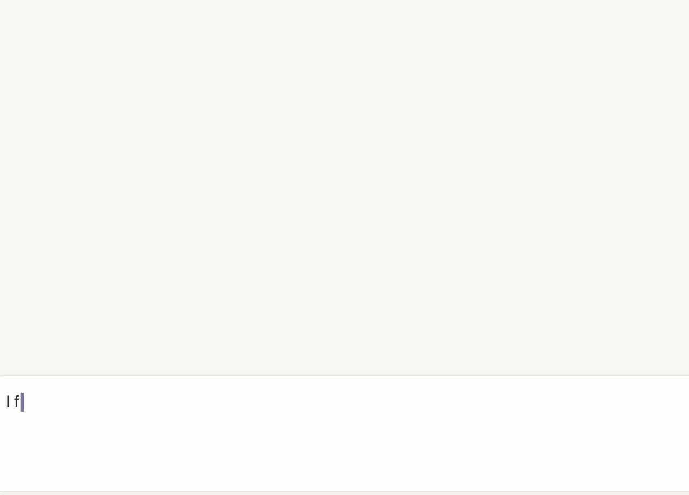

# CBT Assistant — Local AI CBT Companion with Ollama

A local-first AI mental health companion built with Python, FastAPI, SQLite, and Ollama. CBT Assistant combines a private CBT chatbot, RAG over a local cognitive behavioral therapy knowledge base, thought journaling, mood and sleep tracking, self-assessments, guided SOS exercises, and session memory in one browser app.

The main design priority is continuity without a hosted LLM: conversations, journals, assessments, activity data, summaries, and model inference stay on the machine running the app. Optional speech and media features can use external services; see [Privacy and safety](#privacy-and-safety).

Automatic setup on macOS 14 or newer:

```bash
git clone https://github.com/KazKozDev/cbt-assistant.git && cd cbt-assistant
open start_cbt_assistant.command
```

The `.command` file installs the missing runtime dependencies and models, releases port `8000`, starts the application, waits for its health check, and opens the browser.

Automatic setup on Windows 10 22H2 or newer:

```bat
git clone https://github.com/KazKozDev/cbt-assistant.git
cd cbt-assistant
start_cbt_assistant.bat
```

The `.bat` launcher performs the same bootstrap through the included PowerShell helper.

Manual start with Ollama installed and running:

```bash
git clone https://github.com/KazKozDev/cbt-assistant.git && cd cbt-assistant
python3 -m venv .venv
source .venv/bin/activate
python -m pip install -r requirements.txt
ollama pull qwen3:8b
ollama pull qwen3-embedding:4b
python backend/server.py
```

Open `http://localhost:8000` after the server starts.

<p align="center">
  <a href="#automatic-macos-setup"></a>
  <a href="#automatic-windows-setup"></a>
  <a href="#manual-setup"></a>
</p>

<p align="center">Automatic launchers for macOS and Windows; manual setup instructions for Linux.</p>

<p align="center">
  
</p>

---

## Quick start

### Automatic macOS setup

Clone the repository and open the launcher:

```bash
git clone https://github.com/KazKozDev/cbt-assistant.git
cd cbt-assistant
open start_cbt_assistant.command
```

The first launch can take a while because Python packages and approximately 8 GB of Ollama models must be downloaded. Later launches reuse them. The launcher stops whichever process is listening on port `8000` before it starts CBT Assistant.

### Automatic Windows setup

On Windows 10 22H2 or newer, clone the repository and double-click `start_cbt_assistant.bat`. From Command Prompt, use:

```bat
git clone https://github.com/KazKozDev/cbt-assistant.git
cd cbt-assistant
start_cbt_assistant.bat
```

The BAT launcher calls `start_cbt_assistant_windows.ps1`, installs a local `uv` bootstrap and Python 3.12 when needed, creates `.venv`, installs the dependencies, installs and starts Ollama, downloads both models, stops the listener on port `8000`, starts the server, waits for `/api/health`, and opens the default browser. It does not require Administrator rights for the standard Ollama per-user installation.

### Manual setup

1. Install [Python 3.10+](https://www.python.org/) and [Ollama](https://ollama.com/).

2. Clone the repository, create a virtual environment, and install the Python dependencies:

   ```bash
   git clone https://github.com/KazKozDev/cbt-assistant.git
   cd cbt-assistant
   python3 -m venv .venv
   source .venv/bin/activate
   python -m pip install -r requirements.txt
   ```

3. Start Ollama, then download the default chat and embedding models:

   ```bash
   ollama serve
   ```

   In another terminal:

   ```bash
   ollama pull qwen3:8b
   ollama pull qwen3-embedding:4b
   ```

4. Start CBT Assistant from the repository directory:

   ```bash
   source .venv/bin/activate
   python backend/server.py
   ```

   The FastAPI server loads the Markdown CBT knowledge base, creates local embeddings through Ollama, serves the browser interface at `http://localhost:8000`, and stores application data in `data/cbt_sessions.db`.

5. Open the app, choose Russian or English, and start a conversation. The status indicator shows whether Ollama is connected.

On macOS 14 or newer, double-click `start_cbt_assistant.command`. On Windows 10 22H2 or newer, double-click `start_cbt_assistant.bat`. Both launchers prepare Python, install the project dependencies, install and start Ollama, download the required models, stop the existing listener on port `8000`, start CBT Assistant, wait for `/api/health`, and open the app. Later launches reuse the installed environment and models.

> [!IMPORTANT]
> CBT Assistant is a self-help and journaling tool, not a therapist, medical device, crisis service, or substitute for professional care. Its model responses and assessment results can be wrong. If you may be in immediate danger or at risk of harming yourself or someone else, contact local emergency services or a qualified crisis service now.

## Run a private CBT chatbot with a local LLM

The chat uses `qwen3:8b` through Ollama by default. Before each answer, the backend retrieves relevant passages from the local CBT knowledge base and assembles them with recent conversation history, mood entries, thought records, and the saved session summary.

The assistant can also call application tools when the conversation makes them relevant:

- open a breathing exercise;
- suggest PHQ-9 or GAD-7 self-assessment;
- add an agreed action to the activity planner;
- read recent sleep, assessment, and activity data for context.

Regular HTTP and streaming chat endpoints are available, and the browser UI supports speech input when the browser exposes the Web Speech API.

## Use a CBT journaling app with mood and sleep tracking

CBT Assistant keeps structured self-reflection beside the conversation instead of treating every interaction as disposable chat.

- **Thought journal** — record a situation, automatic thought, emotion, intensity, possible distortion, and a more balanced response.
- **Mood tracker** — save a score and note, then review recent changes on the dashboard and calendar.
- **Sleep journal** — track bedtime, wake time, interruptions, duration, quality, and notes.
- **Activity planner** — add concrete actions and mark them complete.
- **Self-assessments** — record PHQ-9, GAD-7, and Rosenberg Self-Esteem Scale results.
- **Reports** — download a TXT summary or create a printable PDF report in the browser.

Some synchronized records are stored in SQLite, while browser-side UI state also uses `localStorage`. Keep the same browser profile if you want that local UI history to remain available.

## Use guided CBT self-help and SOS exercises

The SOS panel provides guided breathing, 5-4-3-2-1 grounding, progressive muscle relaxation, and a STOP exercise. A personal crisis-plan note can be saved in the browser.

These exercises are short self-regulation aids. They are not emergency monitoring, and the application does not contact a clinician, emergency service, or trusted person on your behalf.

## Search a local CBT knowledge base with RAG

The bundled knowledge base contains Markdown material covering clinical CBT guidance, anxiety protocols, insomnia protocols, and psychological skills. At startup, `src/rag/knowledge_base.py` splits these files into sections and requests embeddings from the local `qwen3-embedding:4b` Ollama model.

For each chat message, semantic search selects relevant chunks before the prompt is sent to the local chat model. The same index is available through the knowledge-search API:

```text
GET /api/knowledge/search?q=sleep&top_k=3
```

The knowledge files are project content, not a guarantee that every generated answer is clinically correct or appropriate for an individual user.

## How it works

The browser talks to a FastAPI server running on your computer.<br>
**RAG** retrieves relevant CBT passages through local Ollama embeddings.<br>
**Chat** combines those passages with recent history and structured user data.<br>
**Memory** summarizes longer sessions and saves the summary in SQLite.<br>
**Tools** connect the conversation to assessments, activities, and guided exercises.

```text
Browser UI
   ↓
FastAPI REST + WebSocket API
   ↓
Prompt assembly ← RAG knowledge search
   ↓                  ↓
Ollama chat       Ollama embeddings
   ↓                  ↓
Response          CBT Markdown files
   └──────── SQLite + browser localStorage
```

<details>
<summary>Technical architecture</summary>

### Request path

1. **Startup** — FastAPI loads configuration, initializes `data/cbt_sessions.db`, reads `knowledge_base/*.md`, and embeds the knowledge chunks through Ollama.
2. **Retrieve** — a chat request runs semantic search and selects the top local CBT passages.
3. **Assemble** — the prompt combines the system instructions, retrieved passages, recent messages, mood and thought data, and any rolling session summary.
4. **Generate** — `src/llm/ollama_client.py` sends the request to the configured Ollama chat model. The REST, streaming, or WebSocket path returns the response to the browser.
5. **Persist** — messages and structured records are written to SQLite. After the configured message threshold, `src/memory/summarizer.py` updates the saved session summary.

### Storage

- `data/cbt_sessions.db` stores sessions, messages, mood logs, thought records, sleep logs, assessment results, activities, and session summaries.
- Browser `localStorage` stores the session identifier and parts of the dashboard state, including local mood, sleep, activity, assessment, language, reminder, voice, and crisis-plan settings.
- No hosted LLM API key is required for the default chat and RAG path.

### Important files

- `backend/server.py` — FastAPI application, REST/WebSocket endpoints, tool execution, reports, TTS, and static frontend hosting.
- `src/llm/ollama_client.py` — local Ollama chat and streaming client.
- `src/rag/knowledge_base.py` — Markdown loading, embedding, and semantic retrieval.
- `src/memory/summarizer.py` — rolling conversation summaries.
- `src/utils/db.py` — SQLite schema and persistence.
- `config/prompts.yaml` — assistant behavior, safety instructions, and tool-use guidance.
- `config/model_config.yaml` — default chat and embedding models plus generation settings.
- `frontend/` — bilingual HTML, CSS, and JavaScript interface.
- `knowledge_base/` — local CBT reference material used by RAG.
- `tests/` — database, prompt, RAG, memory, API, and interaction tests.

</details>

<details>
<summary>Configuration</summary>

| Setting | Default | What it controls |
|---|---|---|
| App address | `http://localhost:8000` | Browser interface and API; the server currently binds to `0.0.0.0:8000` |
| Ollama address | `http://localhost:11434` | Local Ollama server; override with `OLLAMA_BASE_URL` |
| Chat model | `qwen3:8b` | Assistant responses; override with `OLLAMA_MODEL` |
| Embedding model | `qwen3-embedding:4b` | RAG embeddings; configured in `config/model_config.yaml` |
| Maximum generated tokens | `1024` | `num_predict` sent to Ollama |
| Temperature | `0.7` | Chat generation sampling |
| Top-p | `0.9` | Chat generation sampling |
| Interface languages | Russian and English | UI labels and requested response language |
| Data file | `data/cbt_sessions.db` | Local SQLite application storage |

Example model override:

```bash
OLLAMA_BASE_URL=http://localhost:11434 \
OLLAMA_MODEL=qwen3:8b \
python backend/server.py
```

The embedding model is not controlled by an environment variable; change `config/model_config.yaml` if you intentionally want to replace it.

</details>

<a id="privacy-and-safety"></a>

<details>
<summary>Privacy and safety</summary>

- Chat generation, embeddings, the bundled CBT knowledge base, and SQLite persistence use the local machine and local Ollama server by default.
- The frontend loads Google Fonts, Lucide icons, and Chart.js from public CDNs.
- Text-to-speech uses Microsoft Edge TTS and sends the text selected for playback to that service.
- Browser speech recognition is provided by the browser and may use a remote service depending on the browser and operating system.
- Video-library thumbnails and playback use YouTube domains.
- Printable PDF reports load Chart.js from a CDN when the report window is created.
- The server binds to `0.0.0.0:8000` and enables permissive CORS. Do not expose it to an untrusted network or the public internet without adding authentication, access controls, and a restrictive network configuration.
- The application has no user accounts, encryption layer, clinician review, emergency dispatch, or automatic crisis escalation.
- PHQ-9, GAD-7, and Rosenberg results are self-assessment aids, not diagnoses.

Review the code and network behavior before entering sensitive information. If you need a strictly offline deployment, the external fonts, scripts, speech, and video integrations must be disabled or replaced with local assets.

</details>

<details>
<summary>Requirements and limitations</summary>

### Requirements

- Python 3.10 or newer.
- Ollama running on the same computer or at the configured `OLLAMA_BASE_URL`.
- Enough memory and disk space for `qwen3:8b` and `qwen3-embedding:4b`, or compatible models you configure yourself.
- Internet access for the first dependency and model downloads. Some optional browser features continue to require network access.
- A modern browser. Automatic launchers support macOS 14+ and Windows 10 22H2+; Linux users can start `backend/server.py` manually.

### Limitations

- This is a single-user local application with no authentication or multi-user isolation.
- Generated mental health guidance can be incomplete, inappropriate, or incorrect. The local knowledge base and prompt safeguards do not make the model clinically reliable.
- The application does not diagnose conditions, prescribe treatment, monitor emergencies, or replace a qualified professional.
- Privacy is local-first, not fully offline, because optional speech, media, fonts, and CDN assets can use external services.
- Model quality and latency depend on the selected Ollama models and local hardware.
- The default startup embeds the knowledge base through Ollama, so the embedding model must be available before the app becomes usable.
- The repository does not currently include a Dockerfile or an automatic Linux bootstrap launcher.

</details>

<details>
<summary>Development setup</summary>

Create the environment and run the deterministic test suite:

```bash
git clone https://github.com/KazKozDev/cbt-assistant.git
cd cbt-assistant
python3 -m venv .venv
source .venv/bin/activate
python -m pip install -r requirements.txt
python -m pytest --ignore=tests/test_real_memory.py
```

These tests cover SQLite behavior, prompt construction, mocked RAG search, mocked memory summarization, API endpoints, and tool execution without requiring a successful model response.

Run the live memory integration separately when Ollama is reachable and the selected `OLLAMA_MODEL` is installed:

```bash
python -m pytest tests/test_real_memory.py -s
```

`tests/test_real_interaction.py` is a manual end-to-end script for an already running application rather than a collected pytest test. Passing any of these checks validates software paths, not the clinical quality of generated responses.

Contributions are welcome. Read [CONTRIBUTING.md](CONTRIBUTING.md) before opening a substantial pull request. Report security-sensitive problems privately as described in [SECURITY.md](SECURITY.md).

</details>

## License

CBT Assistant is free and open-source software licensed under the [MIT License](LICENSE).

<br><br>

<p align="center">
  <a href="https://github.com/KazKozDev/cbt-assistant/blob/main/LICENSE"></a>
  <a href="https://github.com/KazKozDev/cbt-assistant/actions/workflows/tests.yml"></a>
  <a href="https://www.python.org/"></a>
</p>

<p align="center">
  <a href="https://github.com/KazKozDev/cbt-assistant/issues">Issues</a> ·
  <a href="https://github.com/KazKozDev/cbt-assistant/blob/main/CONTRIBUTING.md">Contributing</a> ·
  <a href="https://github.com/KazKozDev/cbt-assistant/blob/main/SECURITY.md">Security</a> ·
  <a href="https://github.com/KazKozDev/cbt-assistant/blob/main/LICENSE">License</a> ·
  <a href="https://www.linkedin.com/in/kazkozdev/">LinkedIn</a>
</p>
