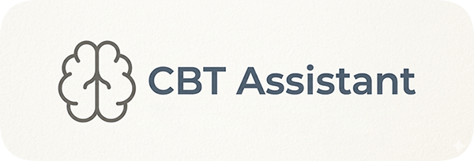

<p align="center">
  
</p>

Local-first mental health companion for low mood, anxiety, depressive symptoms, and sleep-related difficulties, with contextual memory that helps the assistant understand your situation over time, guided self-help tools, and personalized recommendations shaped by the journals, assessments, and activity data tracked in the app, grounded in clinical research and informed by a local CBT knowledge base.

<p align="center">
  
  
  
  
  
</p>

## Highlights

- Local-first chat with Ollama
- RAG over CBT knowledge files
- Session memory with summaries
- Journals, assessments, and SOS tools
- RU/EN interface and TTS

## Demo


## Overview

CBT Assistant combines conversational support, structured self-reflection tools, and retrieval over local CBT materials in one app. It is built for users who want a private, local workflow instead of a cloud chatbot, and for developers who want a small, inspectable codebase around FastAPI, SQLite, and Ollama. The backend serves the API and static frontend, stores session history in SQLite, and uses local LLM plus embedding models through Ollama.

## Motivation

Many mental health assistants are either generic chat wrappers or depend on remote APIs for every interaction. That creates two problems: weak domain grounding and low privacy for sensitive conversations. This project closes that gap by combining a local model, a local CBT knowledge base, structured journals and assessments, and lightweight memory. The stack is intentionally designed so a smaller local model can perform well without fine-tuning, relying instead on retrieval, structured user data, and context persistence to reduce hallucinations and keep behavior more grounded. The result is a single-user assistant that keeps the stack understandable and the data on the user's machine.

## Features

- Chat endpoints for regular and streaming responses.
- RAG search across Markdown knowledge files in `knowledge_base/`.
- Background conversation summarization for longer sessions.
- Mood tracking, thought records, sleep logs, and activity planning.
- Built-in assessments for PHQ-9, GAD-7, and Rosenberg self-esteem.
- SOS tools such as breathing and grounding support flows.
- Text-to-speech with Edge voices and browser-side voice input support.
- Static frontend built with plain HTML, CSS, and JavaScript.

## Architecture

Components:

- `frontend/` renders the web UI and client-side interaction flows.
- `backend/server.py` exposes the API, static files, WebSocket chat, sync routes, reporting, and TTS.
- `src/llm/ollama_client.py` wraps Ollama chat and streaming calls.
- `src/rag/knowledge_base.py` loads Markdown content, builds embeddings, and runs semantic search.
- `src/utils/db.py` manages SQLite persistence for sessions, journals, tests, activities, and summaries.
- `src/memory/summarizer.py` creates rolling session summaries after message thresholds.

Flow:

Browser UI -> FastAPI backend -> prompt assembly + SQLite context + tool calls -> Ollama chat/embeddings -> streamed or standard response back to the browser

## Tech Stack

- Python 3.10+
- FastAPI
- Ollama
- SQLite
- httpx
- edge-tts
- pytest
- Vanilla HTML/CSS/JS

## Quick Start

1. Clone the repository and enter the project folder.

```bash
git clone https://github.com/KazKozDev/cbt-assistant.git
cd cbt-assistant
```

2. Create a virtual environment and install dependencies.

```bash
python -m venv .venv
source .venv/bin/activate
pip install -r requirements.txt
```

3. Start Ollama and pull the required models.

```bash
ollama serve
ollama pull qwen3:8b
ollama pull qwen3-embedding:4b
```

4. Run the backend.

```bash
source .venv/bin/activate
python backend/server.py
```

5. Open `http://localhost:8000`.

6. On macOS, you can also use `./start_cbt_assistant.command` after the virtual environment is prepared.

## Usage

Example run:

```bash
OLLAMA_BASE_URL=http://localhost:11434 \
OLLAMA_MODEL=qwen3:8b \
python backend/server.py
```

Typical scenarios:

- Ask for CBT-style guidance and let the assistant pull relevant context from the local knowledge base before answering.
- Track mood, thought records, sleep, and activities over time in the same session store.
- Use assessments and SOS tools from the browser UI without sending data to a hosted LLM service.

## Project Structure

```text
backend/         FastAPI app and routes
frontend/        Static UI assets
src/llm/         Ollama integration
src/rag/         Knowledge base loading and search
src/memory/      Session summarization
src/utils/       SQLite storage and helpers
knowledge_base/  CBT source material for retrieval
config/          Model and prompt settings
tests/           Pytest suite
```

## Testing

```bash
pytest
```

The repository includes tests for database behavior, prompt generation, RAG search, memory logic, API endpoints, and selected interaction flows.

## Contributing

Issues and pull requests are welcome. For substantial changes, open an issue first to align on scope before implementation.

<details>
  <summary>Areas where contributions would be especially useful</summary>

  <ul>
    <li>Expand and refine the local CBT knowledge base with better-structured clinical materials.</li>
    <li>Add more tests for real user flows, including chat, memory, sync, and recommendation behavior.</li>
    <li>Improve the frontend UX, accessibility, responsiveness, and language polish.</li>
    <li>Extend journaling, assessments, and reporting workflows with clearer insights and history views.</li>
    <li>Improve contextual memory and recommendation quality so responses better reflect long-term user state.</li>
    <li>Strengthen safety behavior and guardrails for sensitive or crisis-adjacent conversations.</li>
    <li>Improve onboarding and local setup with better scripts, checks, and troubleshooting paths.</li>
    <li>Improve documentation with clearer setup notes, examples, and architectural explanations.</li>
  </ul>
</details>

## Status

- Stage: working local application
- Current version: `1.0.1`

---

MIT - see [LICENSE](LICENSE)

If you like this project, please give it a star ⭐

For questions, feedback, or support, reach out to:

[LinkedIn](https://www.linkedin.com/in/kazkozdev/)
[Email](mailto:kazkozdev@gmail.com)
