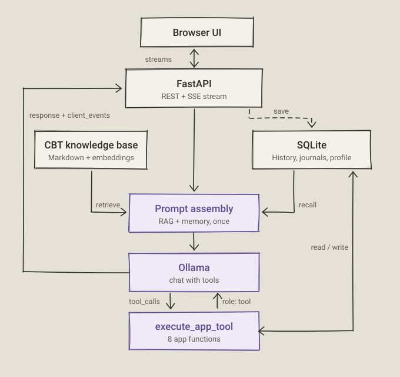

# Architecture

CBT Assistant is a browser frontend backed by FastAPI, local Ollama chat and embedding models, a Markdown CBT knowledge base, and SQLite persistence.

<p align="center">
  
</p>


## Request path

1. **Startup** — FastAPI initializes `data/cbt_sessions.db`, fingerprints `knowledge_base/*.md`, and restores a matching cached index or embeds the complete changed corpus through Ollama.
2. **Retrieve** — every chat transport runs the same semantic search, relevance threshold, provenance serialization, and local retrieval trace.
3. **Assemble** — the prompt combines explicitly delimited evidence passages, recent messages, synchronized records, structured profile memory, and any rolling session summary. Retrieved text is treated as data, not instructions.
4. **Generate** — `src/llm/ollama_client.py` sends the request to the configured Ollama model. REST, streaming, or WebSocket responses return to the browser.
5. **Persist** — messages and structured records are written to SQLite. Explicit personal facts update the profile immediately; after the configured threshold, `src/memory/summarizer.py` refreshes the session summary on every chat transport.

## RAG engineering contract

The bundled knowledge base covers clinical CBT guidance, anxiety protocols, insomnia protocols, and psychological skills.

- Markdown is split by its complete heading hierarchy. Oversized sections are bounded with controlled overlap. The current corpus produces 53 addressable chunks instead of 34 coarse `##` sections.
- The index is fingerprinted from document content and chunking settings. A matching NumPy index is restored from `data/rag_index.npz`; changed content is embedded in batches and swapped into service only after a complete successful build.
- A failed first build prevents RAG from reporting ready. If a rebuild fails while an older complete index is in memory, status becomes `degraded` and the previous index remains usable.
- The default relevance threshold is `0.35`. An unsupported clinical request must not receive an invented protocol or clinical justification.
- Each retrieval writes an ignored local trace to `data/rag_traces.jsonl`: query, candidates, selected chunk IDs, scores, latency, embedding model, threshold, and index version. These traces can contain sensitive query text.
- `GET /api/knowledge/status` reports readiness, index version, model, threshold, cache use, chunk count, and the latest index error.
- `GET /api/knowledge/search?q=sleep&top_k=3` exposes the same versioned index used by chat.

Results carry stable chunk and document IDs, the Markdown source, full section path, index version, similarity score, and local trace ID. Chat returns selected passages in `context_used`; the browser displays them below the answer. The model is instructed to cite clinical claims inline as `[KB:chunk_id]`.

## Memory and storage

- `data/cbt_sessions.db` stores sessions, messages, mood logs, thought records, sleep logs, assessment results, activities, structured personal profiles, and summaries.
- The latest 20 messages are included directly in chat context. A rolling summary is refreshed after every 15 new messages.
- Explicit personal facts such as names, preferences, location, work, close people, and important priorities update the structured profile immediately instead of waiting for summarization.
- Browser `localStorage` stores the session identifier and interface-side mood, sleep, activity, assessment, language, reminder, voice, ambient-sound, and crisis-plan settings.
- The same browser session identity restores its transcript, profile, and summary after reloads or application restarts. Clearing browser storage or changing browser profiles creates a separate memory identity even if older SQLite rows remain.

Derived profile memory and summaries can be inspected or erased separately from the transcript:

```text
GET    /api/memory/{session_id}
DELETE /api/memory/{session_id}
```

## Application tools

The model can call application functions when relevant:

- read recent sleep, assessment, and activity data;
- add an agreed action to the activity planner;
- recommend PHQ-9 or GAD-7;
- after user agreement, open breathing, grounding, progressive muscle relaxation, or STOP with a selected scene and duration from 1 to 10 minutes.

## Configuration

| Setting | Default | What it means |
|---|---|---|
| App address | `http://127.0.0.1:8000` | Browser interface and API; server binds to `127.0.0.1:8000` (override with `HOST` / `PORT`) |
| Ollama address | `http://127.0.0.1:11434` | Override with `OLLAMA_BASE_URL` |
| Chat model | `qwen3.5:9b` | `OLLAMA_MODEL` or `CBT_ASSISTANT_CHAT_MODEL`; any installed completion model can be selected in Settings |
| Embedding model | `sentence-transformers/paraphrase-multilingual-mpnet-base-v2` | FastEmbed ONNX model; override with `RAG_EMBED_MODEL` |
| RAG threshold | `0.46` | Override with `RAG_SCORE_THRESHOLD` |
| Maximum generated tokens | `1024` | `num_predict` sent to Ollama |
| Temperature | `0.7` | Chat sampling value |
| Top-p | `0.9` | Chat sampling value |
| Interface language | English | Russian is available in Settings |
| Data file | `data/cbt_sessions.db` | Local SQLite application storage |

Example manual model override:

```bash
OLLAMA_BASE_URL=http://127.0.0.1:11434 \
OLLAMA_MODEL=qwen3.5:9b \
python backend/server.py
```

Change `RAG_EMBED_MODEL` or `config/model_config.yaml` to use another embedding model. Re-run retrieval evaluation whenever the model, threshold, chunking, or knowledge content changes. The UI model selector reads installed models from Ollama; a choice applies to new requests immediately and is restored from local application data.

## Important files

- `backend/server.py` — FastAPI application, REST/WebSocket endpoints, tools, reports, TTS, and frontend hosting.
- `src/llm/ollama_client.py` — Ollama chat and streaming client.
- `src/rag/knowledge_base.py` — Markdown loading, indexing, embeddings, retrieval, and traces.
- `src/memory/profile.py` — structured profile extraction and merging.
- `src/memory/summarizer.py` — rolling conversation summaries.
- `src/utils/db.py` — SQLite schema and persistence.
- `config/prompts.yaml` — assistant behavior, safety instructions, and tool guidance.
- `config/model_config.yaml` — default models and generation settings.
- `frontend/` — English and Russian browser interface.
- `knowledge_base/` — local CBT material used for retrieval.
- `tests/` — database, prompt, RAG, memory, API, and interaction checks.
